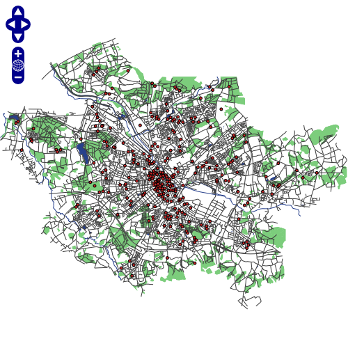

# Alpine Docker container for Mapserver

A minimal Mapserver Docker image based on [Alpine Linux](https://alpinelinux.org/about/) with a complete package index and only 45 MB in size!

## What is Alpine Linux?
Alpine Linux is a Linux distribution built around [musl libc](https://www.musl-libc.org/) and [BusyBox](https://busybox.net/about.html). The pure image is only 5 MB in size and has access to a package repository that is much more complete than other BusyBox based images. 

## Build image

```
docker build -t mapserver .
```

## Start container

```
docker run -d -p 8181:80 -v `pwd`/map:/map mapserver
```

while the command is
```
docker run -d -p [exposed port]:[internal port] -v [your-path]:[container-path] mapserver 
```

## Access container via http

When Docker is forwarded as `localhost` simply open the following URL:
```
http://localhost:8181/cgi-bin/mapserv
```

To make sure the url specified above works the web browser should give a response:
```
No query information to decode. QUERY_STRING is set, but empty.
```

A quick way to access the contents of your mapfile in a browser can be achived by:
```
http://localhost:8181/cgi-bin/mapserv?map=/map/frida.map&mode=browse&template=openlayers&layers=all
```

 The displayed map should look like that:

 

## Create your own `mapfile`

Replace the frida.map with the name of your own mapserver [mapfile](http://www.mapserver.org/mapfile/).

## Tunings

You can use the following environment variables (when starting the container)
to tune it:

* `MS_DEBUGLEVEL`: The debug level 0=off 5=verbose
* `MS_ERRORFILE`: If you want the debug to something other than STDOUT
* `MAX_REQUESTS_PER_PROCESS`: To work around memory leaks (defaults to 1000)

## Enter container via shell  

To enter the container with a shell interface simple switch from `daemon` mode to `interactive` mode.
```
docker run -it -v `pwd`/map:/map mapserver /bin/ash
```
`ash` is the [Almquist Shell](https://en.wikipedia.org/wiki/Almquist_shell), the default shell under [Alpine Linux](https://alpinelinux.org/) provided by [BusyBox](https://busybox.net/about.html).


There you'll see the mapped `/map` folder and can use useful cli tools like
* Mapserver utilities (e.g. `mapserv`): http://www.mapserver.org/utilities/
* Raster utilities (e.g. `gdalinfo`): http://www.gdal.org/gdal_utilities.html
* Vector utilities (e.g. `ogr2ogr`): http://www.gdal.org/ogr_utilities.html
